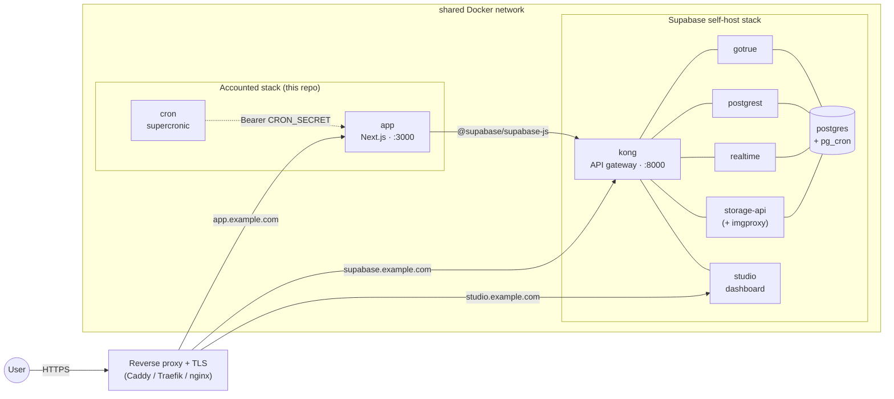

# Self-Hosting Accounted

This guide walks you through deploying Accounted on your own infrastructure using Docker.

## Prerequisites

- Docker and Docker Compose v2+
- A Supabase project (free tier works — create one at [supabase.com](https://supabase.com))

## 1. Create a Supabase Project

1. Go to [supabase.com](https://supabase.com) and create a new project.
2. Note these values from **Settings > API**:
   - `Project URL` (e.g., `https://abcdefgh.supabase.co`)
   - `anon` public key
   - `service_role` secret key

## 2. Configure Supabase Auth

In the Supabase dashboard under **Authentication > URL Configuration**:

1. Set **Site URL** to your deployment URL (e.g., `https://gnubok.example.com`).
2. Add `https://gnubok.example.com/auth/callback` to the **Redirect URLs** allowlist.

Accounted uses email + password authentication with magic link as a fallback. The default Supabase email auth settings work out of the box. For production, configure a custom SMTP provider under **Authentication > SMTP Settings** to avoid Supabase's built-in rate limits.

MFA (two-factor authentication via TOTP) is **not enforced** for self-hosted deployments — the Docker image sets `NEXT_PUBLIC_SELF_HOSTED=true` by default, which disables MFA enforcement. Users can still optionally enable 2FA in Settings > Säkerhet if they wish.

## 3. Apply Database Migrations

The `supabase/migrations/` directory contains the ordered SQL files that set up the full schema, including tables, RLS policies, triggers, and functions.

**Option A — Supabase CLI (recommended):**

```bash
# Install the Supabase CLI
npm install -g supabase

# Link to your project
supabase link --project-ref <your-project-ref>

# Push all migrations
supabase db push
```

**Option B — SQL Editor:**

Run each file in `supabase/migrations/` in order in the Supabase SQL Editor. They must be applied sequentially — later migrations depend on earlier ones.

### PostgreSQL Extensions

The migrations automatically enable these extensions:

| Extension | Migration | Purpose |
|-----------|-----------|---------|
| `uuid-ossp` | 001 | UUID generation |
| `vector` (pgvector) | 033 | AI embedding storage (for AI extensions) |
| `btree_gist` | 042 | Fiscal period overlap prevention |
| `pg_cron` | 048 | In-database scheduled jobs |

These are all available on Supabase hosted. `pg_cron` requires a paid plan — if you are on the free tier, migration 048 will fail. You can safely skip it; the cron sidecar container handles the equivalent job via HTTP instead.

## 4. Configure Environment

**Option A — Setup script (recommended):**

```bash
git clone https://github.com/erp-mafia/gnubok.git
cd Accounted
./setup.sh
```

The script checks prerequisites, prompts for your Supabase credentials, auto-generates `CRON_SECRET`, and writes everything to `.env`.

**Option B — Manual:**

```bash
git clone https://github.com/erp-mafia/gnubok.git
cd Accounted
cp .env.docker.example .env
```

Edit `.env` with your values:

```bash
# ─── Required ───
NEXT_PUBLIC_SUPABASE_URL=https://your-project.supabase.co
NEXT_PUBLIC_SUPABASE_ANON_KEY=your-anon-key
SUPABASE_SERVICE_ROLE_KEY=your-service-role-key
NEXT_PUBLIC_APP_URL=https://your-domain.com
CRON_SECRET=<generate with: openssl rand -hex 32>
```

`NEXT_PUBLIC_APP_URL` must match your public-facing URL. It is used in invoice reminder emails, calendar feed links, and PSD2 callbacks. If left as a placeholder, links will be broken.

## 5. Start the Application

```bash
docker compose up -d
```

This starts two containers:

| Container | Purpose |
|-----------|---------|
| `app` | Next.js application (`ghcr.io/erp-mafia/gnubok:latest`) |
| `cron` | Scheduled jobs via [supercronic](https://github.com/aptible/supercronic) |

The cron container waits for the app health check to pass before starting.

Verify the deployment:

```bash
curl http://localhost:3000/api/health
# {"status":"healthy","timestamp":"...","version":"1.0.0"}
```

> **Note:** The health check queries the database, so migrations must be applied before it returns healthy.

### Building from Source

To build the Docker image locally instead of pulling from GHCR:

```bash
docker compose -f docker-compose.yml -f docker-compose.build.yml up --build
```

The locally-built image runs **unprivileged** (`USER nextjs`): the entrypoint
populates the `.next`/`public` tmpfs mounts and substitutes the `NEXT_PUBLIC_*`
placeholders as the `nextjs` user, so the container needs no Linux capabilities
and runs as-is under the hardened compose defaults (`cap_drop: ALL`,
`read_only: true`).

### Custom Port

Set `PORT` in your `.env` or environment to change the host port (the container always listens on 3000 internally):

```bash
PORT=8080 docker compose up -d
```

## 6. First Login

1. Open your deployment URL in a browser.
2. Click "Skapa konto" (Create account) and register with email + password.
3. Check your email and click the confirmation link.
4. Complete the 5-step onboarding wizard:
   - **Step 1**: Choose entity type (enskild firma or aktiebolag)
   - **Step 2**: Company name and org number
   - **Step 3**: Fiscal year, VAT registration, accounting method
   - **Step 4**: Preliminary tax amount (optional, skip if unsure)
   - **Step 5**: Bank details for invoices (optional)

There is no admin account or invite system — any email address can sign up. You can also use the magic link option on the login page if preferred.

## Scheduled Jobs

The cron sidecar runs these jobs automatically:

| Schedule (UTC) | Endpoint | Purpose |
|----------------|----------|---------|
| Daily 06:00 | `/api/deadlines/status/cron` | Update deadline statuses |
| Daily 08:00 | `/api/invoices/reminders/cron` | Send overdue invoice reminders |
| Yearly Jan 2 | `/api/tax-deadlines/cron` | Generate tax deadlines for the new year |
| Sundays 03:00 | `/api/documents/verify/cron` | SHA-256 integrity check on document archive |

All cron endpoints are authenticated with `Authorization: Bearer <CRON_SECRET>`. The cron container calls the app over the internal Docker network (`http://app:3000`), so these endpoints are not exposed publicly.

Additionally, migration 048 schedules a `pg_cron` job inside the database that marks overdue supplier invoices daily at 06:00 UTC.

## Optional Features

### AI Features

The self-hosted Docker image includes these AI-powered extensions: receipt OCR, AI categorization, AI chat, and invoice inbox. To enable them, add API keys to your `.env`:

```bash
ANTHROPIC_API_KEY=sk-ant-...    # Required for all AI features
OPENAI_API_KEY=sk-...           # Required for embedding-based features (categorization, chat)
```

Each user must individually grant AI consent in the UI before AI features activate (per GDPR requirements).

**AI chat knowledge base** (optional): The AI chat can answer Swedish tax and accounting questions using a RAG knowledge base. To populate it, create `dev_docs/ai_knowledge_base/` with markdown files and run:

```bash
npx tsx extensions/general/ai-chat/ingestion/ingest.ts
```

**Booking template embeddings** (optional): For AI-powered transaction categorization suggestions, seed the template embeddings by calling:

```bash
curl -X POST -H "Authorization: Bearer $CRON_SECRET" \
  https://your-domain.com/api/admin/seed-template-embeddings
```

### Email (Invoice Sending and Reminders)

```bash
RESEND_API_KEY=re_...
RESEND_FROM_EMAIL=noreply@your-domain.com
```

Requires a [Resend](https://resend.com) account with a verified sender domain. Without this, invoices can still be generated as PDFs but cannot be emailed.

### Push Notifications

```bash
NEXT_PUBLIC_VAPID_PUBLIC_KEY=...
VAPID_PRIVATE_KEY=...
VAPID_SUBJECT=mailto:you@example.com
```

Generate VAPID keys with `npx web-push generate-vapid-keys`. Push notifications require HTTPS.

### Error Tracking (Sentry)

```bash
SENTRY_DSN=https://...@sentry.io/...
NEXT_PUBLIC_SENTRY_DSN=https://...@sentry.io/...
```

Sentry is disabled if these are not set. No errors are thrown.

## Storage Buckets

Migration 024 automatically creates the `documents` storage bucket (private, 50 MB limit, WORM — no update/delete).

If you enable the **receipt-ocr** extension, you must manually create a `receipts` storage bucket in the Supabase dashboard:

1. Go to **Storage** in the Supabase dashboard.
2. Create a new bucket named `receipts`.
3. Set it as **public** (receipt images are referenced by public URL).
4. Set an appropriate file size limit (e.g., 10 MB).

## Updating

Pull the latest image and restart:

```bash
docker compose pull
docker compose up -d
```

If a new release includes database migrations, apply them before restarting:

```bash
supabase db push
```

Check the [release notes](https://github.com/erp-mafia/gnubok/releases) for migration instructions.

## Architecture Overview

```
┌─────────────────────┐     ┌──────────────────┐
│   Docker: app       │     │  Docker: cron     │
│   (Next.js)         │◄────│  (supercronic)    │
│   Port 3000         │     │  Bearer auth      │
└────────┬────────────┘     └──────────────────┘
         │
         │ HTTPS
         ▼
┌─────────────────────┐
│  Supabase           │
│  - PostgreSQL + RLS │
│  - Auth (email+pw)  │
│  - Storage (docs)   │
└─────────────────────┘
```

The Next.js app is stateless — all data lives in Supabase. The Docker entrypoint injects your `NEXT_PUBLIC_*` environment variables into the pre-built JS bundles at container startup, so a single image works with any Supabase project.

## Fully Self-Hosted (No Supabase Cloud)

The setup above relies on a Supabase project at supabase.com. If you also want to host the database, auth, and storage yourself — to keep all data on-premises, avoid the SaaS dependency, or run air-gapped — you can pair Accounted with [Supabase's official Docker self-hosting stack](https://supabase.com/docs/guides/self-hosting/docker) instead.

This is a more involved path. You take responsibility for backups, TLS certificates, image upgrades, and Postgres operations. It is intended for operators already running Docker services who are comfortable with PostgreSQL.

### Architecture



### Setup outline

1. **Bring up Supabase** following [supabase.com/docs/guides/self-hosting/docker](https://supabase.com/docs/guides/self-hosting/docker). Generate your own `JWT_SECRET`, `ANON_KEY`, and `SERVICE_ROLE_KEY` (Supabase ships `sh utils/generate-keys.sh`). Pick a hostname for the API gateway (e.g. `supabase.example.com`) and point `SUPABASE_PUBLIC_URL` / `API_EXTERNAL_URL` at it.

2. **Apply the Accounted migrations** directly via `psql` — the Supabase CLI (`db push`) assumes a cloud project, so run the SQL files against the self-hosted database container:

   ```bash
   # From the repo root, stream each migration straight into the supabase-db
   # container — glob order is already sorted, and nothing is left behind on the
   # host or in the container.
   for f in supabase/migrations/*.sql; do
     echo "Applying $f..."
     docker exec -i supabase-db psql -v ON_ERROR_STOP=1 -U postgres -d postgres < "$f" || exit 1
   done
   ```

3. **Configure `.env`** with your self-hosted endpoints (extract the keys from your Supabase `.env`):

   ```bash
   NEXT_PUBLIC_SUPABASE_URL=https://supabase.example.com
   NEXT_PUBLIC_SUPABASE_ANON_KEY=<ANON_KEY from supabase .env>
   SUPABASE_SERVICE_ROLE_KEY=<SERVICE_ROLE_KEY from supabase .env>
   NEXT_PUBLIC_APP_URL=https://app.example.com
   CRON_SECRET=<openssl rand -hex 32>
   NEXT_PUBLIC_SELF_HOSTED=true
   ```

4. **Allowlist the callback URLs** in GoTrue's redirect list (the Supabase stack's `.env`), then recreate the auth container so it picks up the change:

   ```bash
   ADDITIONAL_REDIRECT_URLS=https://app.example.com/auth/callback,https://app.example.com/api/auth/callback
   ```
   ```bash
   cd <your-supabase-dir> && docker compose up -d auth
   ```

5. **Reverse proxy** in front of both hosts. The app container and the Supabase `kong` container must share an external Docker network so the proxy can route to them by name.

### What you give up vs. cloud Supabase

- **Backups** are entirely your responsibility — set up `pg_dump` (or a tool like restic) to off-host storage. As a portable, vendor-neutral *logical* backup on top of the raw dump, you can also export each fiscal period as a standard **SIE4** file via the API and archive it — any Swedish bookkeeping system can re-import it:

  ```bash
  curl -fsS -H "Authorization: Bearer <reports:read API key>" \
    "$NEXT_PUBLIC_APP_URL/api/v1/companies/<companyId>/reports/sie-export?period_id=<periodId>" \
    -o "export_<periodId>.se"
  ```
- **Storage**: the included `storage-api` defaults to the local-filesystem backend. For production durability, use the `docker-compose.s3.yml` overlay and point it at S3 / MinIO.
- **SMTP**: no built-in mailer. Either set `ENABLE_EMAIL_AUTOCONFIRM=true` for dev/staging, or wire `SMTP_*` env vars in the Supabase stack to a provider (Resend, Postmark, etc.).
- **Upgrades**: you sync the `supabase/postgres` image yourself — your data lives in the DB volume, so a Postgres image bump needs no migration re-run. When you pull a newer Accounted release, apply only the **new** migration files added since your last deploy (the SQL is not idempotent, so re-running already-applied migrations will error). Track which migrations you've applied, e.g. with a checksum/version table.

### Notes

- **`pg_cron`** is included in the `supabase/postgres` image, so the `pg_cron` migration succeeds (unlike on the Supabase free tier — see the standard self-hosting flow above).
- **MFA**: as on the standard path, `NEXT_PUBLIC_SELF_HOSTED=true` disables enforcement; users may still enable TOTP voluntarily.

## Troubleshooting

**Health check fails with "unhealthy":**
Migrations have not been applied, or the Supabase credentials are wrong. Check that `NEXT_PUBLIC_SUPABASE_URL` and `SUPABASE_SERVICE_ROLE_KEY` are correct and that migrations have been pushed.

**Confirmation email not arriving:**
Check the Supabase dashboard under **Authentication > Users** to verify the signup attempt was received. On the free tier, Supabase rate-limits emails to 4/hour. Configure custom SMTP under **Authentication > SMTP Settings** for production use.

**Auth callback redirects to error:**
Ensure `https://your-domain.com/auth/callback` is in the Supabase **Redirect URLs** allowlist and that **Site URL** matches your `NEXT_PUBLIC_APP_URL`.

**`pg_cron` migration fails:**
`pg_cron` requires a paid Supabase plan. On the free tier, you can safely comment out migration 048 or let it fail — the overdue supplier invoice check is non-critical and can be triggered manually.

**Container restarts in a loop:**
Check logs with `docker compose logs app`. The app requires all five core env vars (`NEXT_PUBLIC_SUPABASE_URL`, `NEXT_PUBLIC_SUPABASE_ANON_KEY`, `SUPABASE_SERVICE_ROLE_KEY`, `NEXT_PUBLIC_APP_URL`, `CRON_SECRET`) and will crash on startup if any are missing.
